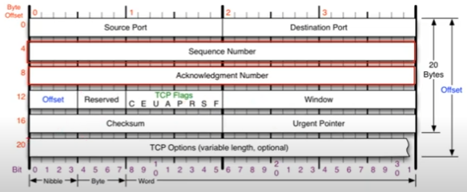
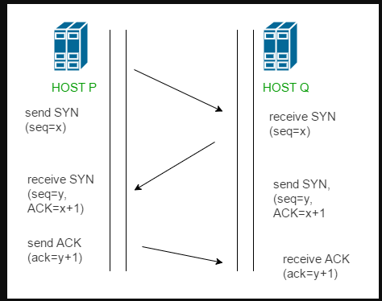

# UDP 프로토콜

* 사용자 데이터 그램 프토콜
* 비연결 지향
* 전송방식이 단순하여 신뢰성이 낮다.
* 오류의 검사와 수정이 필요 없는 프로그램에서 수행한다고 가정

### 구조 

송신자 포트번호(2byte)-수신자포트번호(2byte)-길이(헤더부터 페이로드까지 포함한 길이 Byte단위)-checksum(프로토콜이 잘못된게 있는지 체크)

### UDP사용 프로그램

* DNS 서버(도메인 주소의 IP주소를 알려줌)
* tftp서버
* RIP 프로토콜

# TCP

* 전송 제어 프로토콜(Transmission Control Protocol)
* UDP와 다르게 기능이 다양하고 복잡하다
* 연결지향적 프로토콜
* 안정적으로, 순서대로, 에러없이 교환할 수 있게 해줌
* 안전한 대신 느리기 때문에 안정성을 필요로 하지 않는다면 UDP를 사용한다.

### 구조 

출처 : https://www.youtube.com/watch?v=cOK_f9_k_O0&list=PL0d8NnikouEWcF1jJueLdjRIC4HsUlULi&index=21

* Offset - 헤더의 길이를 표현하는 부분

* Reserved - 예약된 필드(사용안함)

* TCP flag - C E U A P R S F 로 구성되어있음, 연결 상태를 보내주는 것(연결을 하려는건지 데이터를 보내려는건지 연결을 끊으려는지 등)
  * U - Urgent Flag, 긴급비트라고 한다. 우선순위가 높은 데이터가 포함되어 있는 경우 1로 세팅
  * A - Ack Flag, 승인비트라고 한다. 승인을 해줄 때 사용하는 플래그(연결이나 데이터 전송)
  * P - Push, TCP버퍼의 공간이 충분히 쌓이지 않아도 데이터를 계속 밀어넣겠다 라고 할 때 1로세팅
  * R - Reset, 초기화 비트, 문제가 발생해서 리셋할 경우 1로 세팅
  * S - Sync Bit, 동기화 비트, 상대방과 연결을 시작할 때 사용하는 플래그 동기화를 시작한다는 의미를 가짐
  * F - Fin, 종료비트, 데이터를 모두 주고받은 이후, 연결을 끊을 때 사용하는 플래그

* Window - 데이터를 얼마나 더 보낼지 정보가 담겨있는 곳(자신의 사용공간이 얼마나 남아잇는지)

* Urgent Pointer - U flag와 세트 긴급데이터가 어느위치에 있는지 표기하는 데이터

* TCP Option - IP 의 옵션과 같이 4Byte씩 붙으며 최대 10개까지 붙을 수 있다.(안붙을 수도 있다.) TCP 최대 용량: 60Byte

### 통신과정

* 연결 수립 과정

  통신을 할 때 프로세스와 프로세스 연결을 위해 가장 먼저 수행되는 과정

  1. 클라이언트가 서버에게 요청 패킷 전송
  2. 서버가 클라이언트의 요청을 받아들이는 패킷 전송
  3. 이를 최종적으로 수락

  3-Way Handshaking이라고 함

  

  출처 : https://github.com/gyoogle/tech-interview-for-developer/blob/master/Computer%20Science/Network/TCP%203%20way%20handshake%20%26%204%20way%20handshake.md

  - P->Q :싱크플래그를 1로 세팅해서 데이터 전송 Ack 번호는 0번으로 세팅해서 보냄 Seq번호도 세팅되어있음

  * Q->P: SYN, ACK 플래그 1로 세팅, Seq번호 세팅 및 ACK번호는 받은 Seq번호+1을 해서 보냄
  * P->Q:  ACK플래그를 1로 세팅, Seq번호와 Ack번호를 변경해서 보냄

* 데이터 송수신 과정

  TCP패킷만을 캡슐화해서 통신하는 것이 아닌 페이로드를 포함한 경우의 규칙

  1. 보낸쪽에서 또 보낼 경우, SEQ번호와 ACK번호는 그대로
  2. 받는 쪽에서 SEQ번호는 받은 ACK번호가 됨
  3. 받는 쪽에서 ACK번호는 받은 SEQ번호 + 데이터의 크기